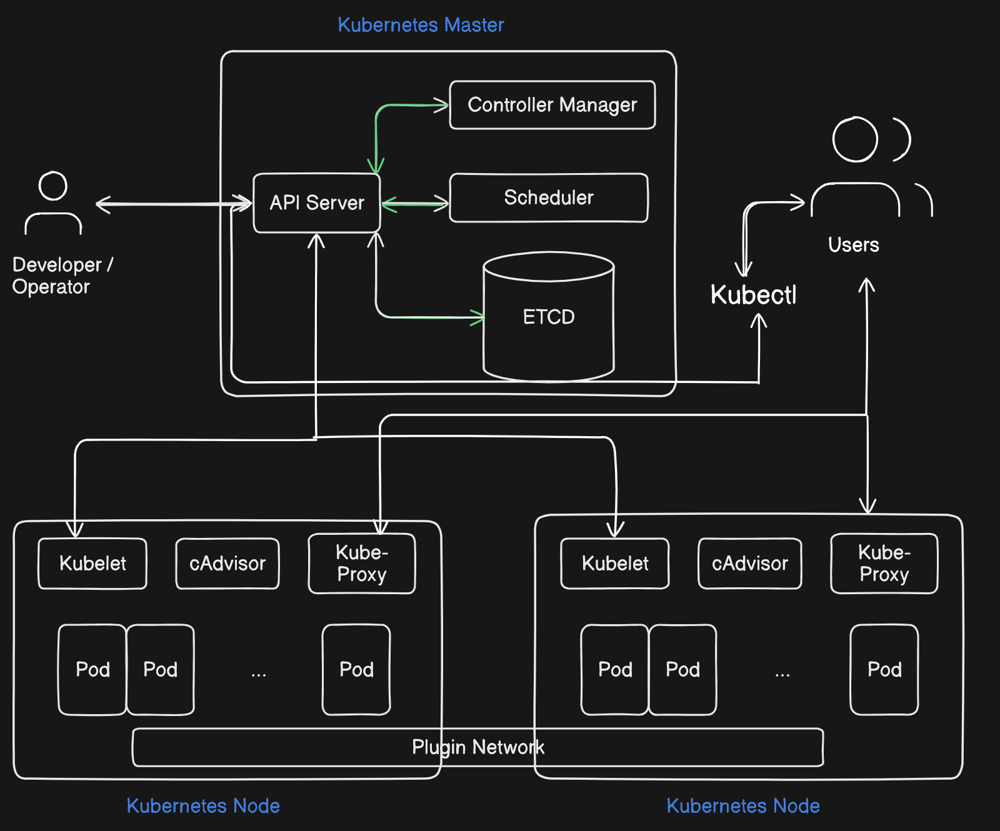

# K8s_DAY_05
# Kubernetes Control Plane Overview

This repository provides an overview of the Kubernetes control plane components and their functions, along with a visual diagram depicting the end-to-end flow when running a `kubectl` command.

## Diagram: End-to-End Flow of a `kubectl` Command

*The diagram above shows the flow of information and actions taken when a `kubectl` command is executed in a Kubernetes cluster.*

## Control Plane Components and Their Functions

### 1. kubectl
- **Function**: `kubectl` is the command-line tool used to interact with your Kubernetes cluster. It sends commands to the API Server to manage cluster resources.

### 2. API Server
- **Function**: The API Server acts as the gateway to the Kubernetes control plane. It processes RESTful requests from `kubectl` and other components, ensuring that the cluster's state is up to date.

### 3. etcd
- **Function**: `etcd` is a distributed key-value store that holds all the data required to manage the cluster, including the state of all the resources within it. The API Server reads from and writes to `etcd` to ensure the desired and actual states of the cluster are maintained.

### 4. Controller Manager
- **Function**: The Controller Manager oversees various controllers that monitor the cluster's state. If the actual state diverges from the desired state, the Controller Manager takes corrective actions to bring them in line.

### 5. Scheduler
- **Function**: The Scheduler is responsible for selecting the appropriate node for a new pod to run on. It considers the pod's resource requirements and the available resources in the cluster to make this decision.

### 6. Kubelet
- **Function**: The Kubelet runs on each worker node, receiving instructions from the API Server. It ensures that the containers described in the pod spec are running and healthy on its node.

## Understanding Pods and Containers

### Pod
- **Definition**: A pod is the smallest deployable unit in Kubernetes. It can contain one or more containers that share the same network namespace and storage volumes.

### Container
- **Definition**: A container is a lightweight, portable, and self-contained execution environment that includes everything needed to run a specific application, such as the code, runtime, libraries, and dependencies.

